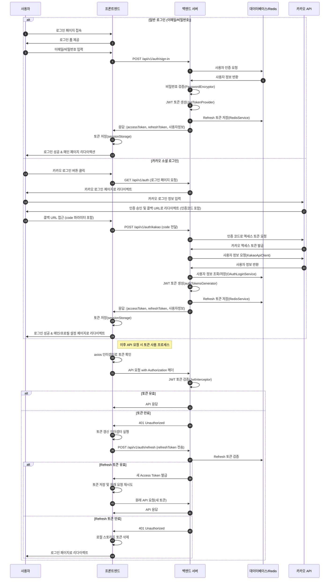
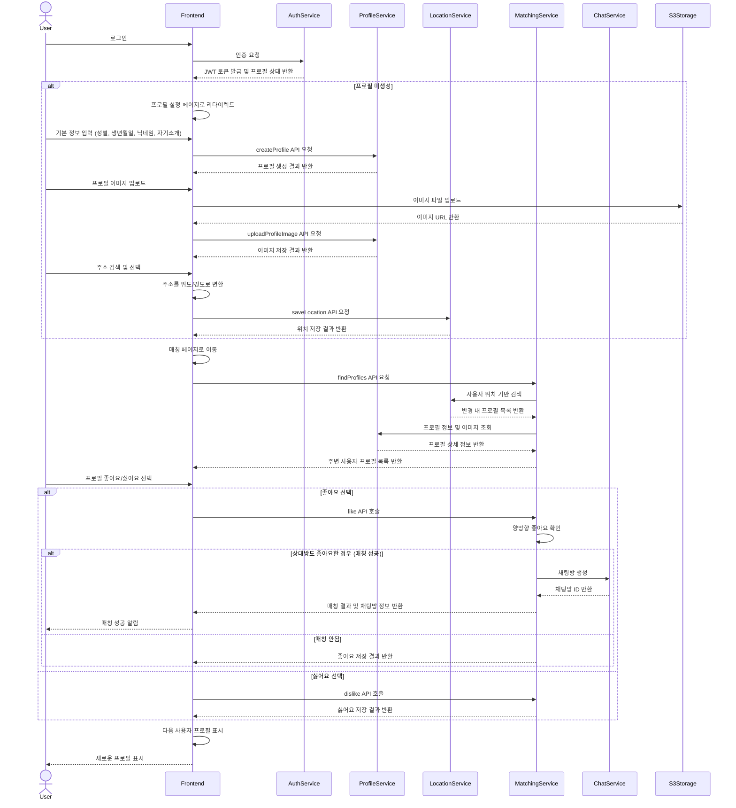
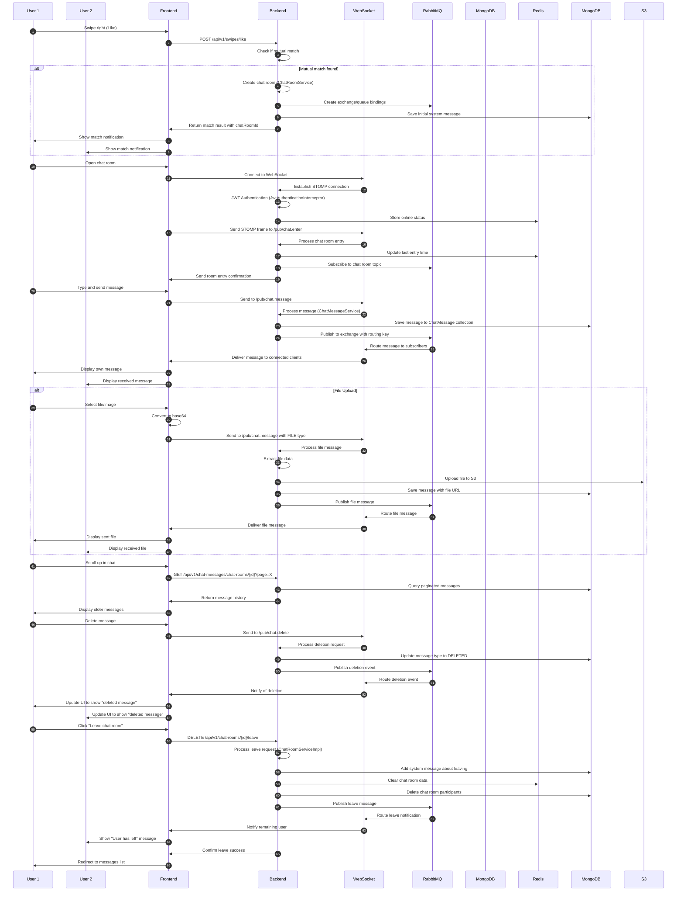

# Back
<div align="center">

# 🐬 NDolphin
유저 매칭과 실시간 채팅을 위한 고가용성 메시징 서버

[//]: # (https://www.ndolophin.com/)

[2025/02/13] : 서버 비용문제로 인스턴스 종료하였습니다

[](https://spring.io/)
[](https://www.docker.com/)
[](https://aws.amazon.com/)
[](https://www.nginx.com/)
[](https://www.mongodb.com/)
[](https://www.postgresql.org/)
[](https://redis.io/)
[](https://www.rabbitmq.com/)

</div>

## ⚡️ 주요 기능

- `사용자 인증`: JWT와 SMTP, Kakao OAuth2.0을 통한 보안 강화
- `유저 매칭` : PostGis의 거리 계산 쿼리를 이용한 일정 범위 내 유저 추천
- `유저 필터링` : 한번 매칭된 유저 혹은 싫어요를 누른 유저를 추천에서 제외
- `실시간 채팅`: WebSocket(STOMP)과 RabbitMQ를 활용한 실시간 메시징
- `무중단 배포`: Blue/Green 배포 전략을 통한 서비스 안정성 확보
- `이미지 업로드`: AWS S3를 활용한 프로필 이미지 관리
- `채팅 메세지 관리`: 채팅 메세지는 NOSQL에 따로 저장

[//]: # (- `실시간 알림`: Redis를 활용한 효율적인 실시간 알림 처리)

## 🏗️ 시스템 아키텍처

<div align="center">

</div>

## 🛠 Tech Stack

### Infrastructure


### Backend


### Database


## 📝 API Documentation
```http
http://{server-url}:8080/swagger-ui.html
http://{server-url}:8081/swagger-ui.html
```

## 💡 상세 기능

### 채팅
- 실시간 1:1 채팅
- 채팅방 목록 조회
- 페이징으로 메세지 조회
- 읽지 않은 메시지 카운트
- 이미지 전송 기능
- 채팅방 나가기

### 유저 매칭
- 프로필 추천 (거리 기반)
- 좋아요/싫어요 기능
- 매칭 시 채팅방 자동 생성

### 프로필
- 프로필 이미지 관리
- 기본 정보 설정 (나이, 성별, 주소)
- 관심사 설정
- 자기소개 관리


## 🔐 로그인 플로우




## 유저(프로필) 매칭 플로우



## 채팅 플로우


